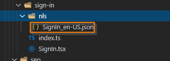
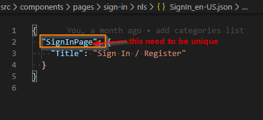
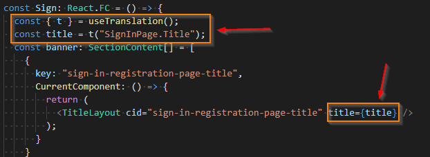

[//]: # "================================================="
[//]: # "Licensed Materials - Property of HCL Technologies"
[//]: #
[//]: # "HCL Commerce"
[//]: #
[//]: # "(C) Copyright HCL Technologies Limited 2020"
[//]: #
[//]: # "================================================="

## Introductiontest

This project is the HCL Commerce Store SDK. The project provides a development environment with React store applications for a
B2C-based store called Emerald and a B2B-based store called Sapphire. The applications themselves share common code and differ
only in styling, messages, and page flows. The applications use common React libraries available for Web Developers for
various capabilities including for routing and display.

The application provides a set of foundational React components for interacting with HCL Commerce business logic
that can be used as the basis for creating and managing your custom store and allow web developers to focus on
customizing and replacing the display and view aspects of the store. All aspects of the React application, including the
foundation, are customizable by web developers and are provided as references to interact with HCL Commerce REST APIs and session management.

The visual design of the React application gives control of pages and layouts to the React Web Developer while interacting with marketing content,
products and category data, and SEO page metadata managed by business users from Commerce Management Center tools.

This project was bootstrapped with [Create React App](https://github.com/facebook/create-react-app).

This project will be updated with enhancements and fixes as new versions of HCL Commerce Store SDK are made available. Please refer to the UPDATES.md file
within this project for details.

## Setup

### Prerequisites

The project can be loaded on any environment supporting Node.js development. We recommend:

- Node.js 14.15.1 or higher
- npm 6.14.8 or higher

### Development environment Transaction Server and Search Query Server proxy config

This project provides a flexible environment in which a React web developer can create pages for the store. The developer can develop
pages in the following modes:

1.  Without any server connection using mock mode to emulate REST API responses from servers.
1.  With local Transaction and/or Search Query server by configuring proxy config file to localhost host name.
1.  With remote Transaction and/or Search Query server by configuring proxy config file to remote host name.

In the `src\setupProxy.js` file, update the following constants with the proper SEARCH_HOST server name and port number (search-query-app)
and TRANSACTION_HOST server name and port number (ts-app). Note: this project is designed to work with only
Elasticsearch V2 APIs. The CMC_HOST constant is for accessing admin tools inside B2B store. Please update it with CMC server name and port number. The port number differs for how we are setting up the new CMC tooling web component. If we setup the new CMC tooling web component in development (node) environment, the port number is 7443, otherwise(docker run time environment) the port number is 8000. The DX_HOST constant is for HCL Commerce - DX integration and update it with HCL DX server name and port number accordingly.

```js
// update to point to your Search Query Server (if remote docker, replace with https://<hostname or ip>:30901)
const SEARCH_HOST = "https://localhost:30901";

// update to point to your Transaction Server (if remote docker, replace with https://<hostname or ip>:5443)
const TRANSACTION_HOST = "https://localhost";

// update to point to your CMC - Management centre (Replace with https://<hostname or ip>:8000 or 7443)
const CMC_HOST = "https://localhost:8000";

// update to point to your HCL DX server (Replace with https://<hostname or ip>:port)
const DX_HOST = "https://localhost";
```

To complete the setup, run the following commands from the project directory:

###`npm install`

Installs dependencies required for the build process. Running this command requires external connectivity to react libraries available online.

## Available Scripts

In the project directory, you can run the following commands:

### `npm start`

Runs the app in development mode.<br>
Open [http://localhost:3000](http://localhost:3000) to view the application in a browser. <br>
The default app and store is `Emerald`. To start a different app, such as Sapphire, use `npm start -- --appName <storeName>`.

In development mode, the page reloads when you make any edits.<br>
You can also see any lint errors in the console.

To display other extended sites stores published in Commerce, pass the storeId parameter: 'https://localhost:3000?storeId=<eSite storeId>'

### `npm run mock`

Runs the app in the development mode using mock data services.<br>
Open [http://localhost:3000](http://localhost:3000) to view the application in a browser.<br>
The default app and store is `Emerald`. To start a different app, such as Sapphire, use `npm run mock -- --appName <storeName>`.

As an example, a sample set of mock data services are included to showcase the Emerald store. These mock data services are located in the '/mocks' directory.
These mock services highlight the display of pages through:

- Home Page Marketing Spots
- Browse from 'Living Room -> Furniture -> Flared Accent Chair'
- Login & Registration
- Cart and Checkout of Chair

### `npm run preview`

Runs the app in the development mode serving CMC preview.<br>
Open [https://localhost:6443/Emerald](https://localhost:6443/Emerald) to preview it in CMC.<br>
The default app and store is `Emerald`. To start a different app, such as Sapphire, use `npm run preview -- --appName <storeName>`.
<br>
To use a different port for the preview, pass the port number: `npm run preview -- --appName <storeName> --port 5888`.

### `npm run build`

Builds the app for production to the `dist` folder instead of `react-scripts` default `build` folder.<br>
It correctly bundles React in production mode and optimizes the build for the best performance.<br>
By default, only the bundle for store `Emerald` is built. To build multiple store bundle, use comma separated store name as command line arguments.
For e.g. `npm run build -- --appName Emerald,Sapphire`

The build is minified and the filenames include the hashes.<br>
Your app is ready to be deployed!

For more information, see the section about [deployment](https://facebook.github.io/create-react-app/docs/deployment) .

For options on build and deployment of the react application in the Commerce environment,
refer to HCL Commerce documentation here: [Build and deploy](https://help.hcltechsw.com/commerce/9.1.0/storeseparation/refs/react_buildanddeploy.html) .

### `npm run eject`

**Note: this is a one-way operation. Once you `eject`, you can’t go back!**

If you are not satisfied with the build tool and configuration choices, you can `eject` at any time. This command removes the single build dependency from your project.

Instead, it copies all the configuration files and the transitive dependencies (Webpack, Babel, ESLint, and so on) right into your project so you have full control over them. All of the commands except `eject` will still work, but they will point to the copied scripts so you can tweak them. At this point you’re on your own.

You don't have to ever use `eject`. The curated feature set is suitable for small and middle deployments, and you shouldn’t feel obligated to use this feature. However, we understand that this tool wouldn’t be useful if you couldn’t customize it when you are ready for it.

## Development Tips

### Translation support to our app

- See https://react.i18next.com/ for instructions about how to use, Hook, HOC, Trans components and others.
- To create translatable JSON file, create an nls folder under the component directory, and name your file xxxx_en-US.json (Note: i18next using hyphen instead of underscore in locale string). Refer to file src\components\pages\sign-in\nls\SignIn_en-US.json as an example.

  

- The top level field (root) name in the json file must be unique across the app

  

- A simple usage of translation is depicted below:

  

### LocalStorage and SessionStorage

To use `localStorage` and `sessionStorage`, use `storageUtil` which provides the following features:

- Provides a wrapper around the `localStorage` and `sessionStorage` object. The availability of the storage, whether out of space or storage does not exist, is properly handled.
- Scopes the storage by prefixing the storage key with proper storefront namespace and storeIdentifier.
- Provides the capability to specify the lifespan of a `localStorage` item and invalidate it once it expires.

### Generating rest service JS code based on Swagger spec json file

The rest service JS code is output to the `src/apis` folder, the generated code runs a basic validation of the request before sending it out.

Swagger v1.X example:

`npm run generate-rest -- --name guestIdentity --resourceDomain Transaction --spec tools/scripts/codeGen/swaggerSpec/commerce/guestIdentity.swagger.json --ops 'login,logout'`

Swagger v2.x example with tag:

`npm run generate-rest -- --name products --resourceDomain Search --spec tools/scripts/codeGen/swaggerSpec/commerce/searchV2.swagger.json --tag v-2-product-view-resources --ops 'findProductsUsingGET'`

### Axios call in component.

It is a good practice to cancel the Axios promise upon component unmounted to prevent possible memory leak if the state of component will be changed when the response is returned
For example, in `CategoryRecommendationLayout.tsx`:

```jsx
  const [content, setContent]=useState({});
  let cancel: Canceler;
  const parameters: any = {
      storeId: storeID,
      name: _eSpotName,
      catalogId: catalogID,
      cancelToken: new CancelToken(function executor(c) {
        cancel = c;
      })
    };
    eSpotService
      .findByName(parameters)
      .then(res => {
        setContent(res);
    ....
  // cancel the axios request upon component unmounted.
  React.useEffect(()=>{
    initEspot(),
    return ()=>cancel();
  }, [...])
```

### Managing Shopper Sessions

The React foundation provides capability to manage sessions using WC Tokens for Generic, Guest and Registered Shopping session. Guest shopper sessions are created
when specific services are being invoked. The list of user required services is defined in the constant file `src/_foundation/configs/userRequiredService.ts`.

### B2B Store

To develop a B2B store:

1. In `.env` file, use REACT_APP_STORENAME=Sapphire (a B2B storename).
2. There are two ways to separate B2B and B2C logic:
   - In `src/configs/routes.ts` update `ROUTE_CONFIG` so that B2B and B2C have different a component in route.
   - Use `useSite` hook to get site information, a `isB2B` flag is available once the site info is ready. This flag can be used in the components to separate B2B and B2C logic.

### Storybook

We are using [Storybook](https://storybook.js.org/docs/basics/introduction/) as developer documentation for UI components. To view Storybook, run `npm run storybook`.

### Material Table

We use the [Material Table](https://material-table.com/#/docs/get-started/) as a reusable table component.

### Styled Components

We use [styled-components](https://styled-components.com/) is used as the primary way of applying CSS to React components.

## Start docker container

1. The docker image is based on IHS base docker image and packaged the dist asset built from this project.
2. The docker container listens to port 6443.
3. To start the docker container, run the following command. You can then access HCL Commerce tooling by opening https://localhost:6443 in a browser.

## Learn More

You can learn more in the [Create React App documentation](https://facebook.github.io/create-react-app/docs/getting-started).

To learn React, check out the [React documentation](https://reactjs.org/).

### Code Splitting

This section has moved here: https://facebook.github.io/create-react-app/docs/code-splitting

### Analyzing the Bundle Size

This section has moved here: https://facebook.github.io/create-react-app/docs/analyzing-the-bundle-size

### Making a Progressive Web App

The sample Emerald and Sapphire applications are implemented with support for Progressive Web App (PWA) and the resulting store can be
installed as an app on devices supporting PWA.
For more information on PWA, see: https://facebook.github.io/create-react-app/docs/making-a-progressive-web-app

### Advanced Configuration

This section has moved here: https://facebook.github.io/create-react-app/docs/advanced-configuration

### Deployment

This section has moved here: https://facebook.github.io/create-react-app/docs/deployment

### `npm run build` fails to minify

This section has moved here: https://facebook.github.io/create-react-app/docs/troubleshooting#npm-run-build-fails-to-minify
