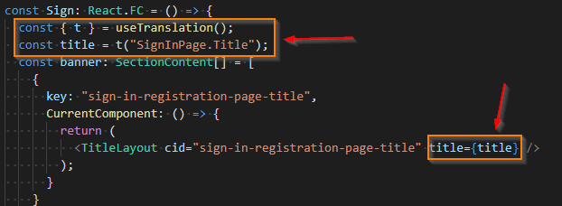

[//]: # "================================================="
[//]: # "Licensed Materials - Property of HCL Technologies"
[//]: #
[//]: # "HCL Commerce"
[//]: #
[//]: # "(C) Copyright HCL Technologies Limited 2020-2022"
[//]: #
[//]: # "================================================="

## Introduction

This project is the HCL Commerce Store SDK. The project provides a development environment with React store applications for a
B2C-based store called Emerald and a B2B-based store called Sapphire. The applications themselves share common code and differ
only in styling, messages, and page flows. The applications use common React libraries available for Web Developers for
various capabilities including for routing and display.

The application provides a set of foundational React components for interacting with HCL Commerce business logic
that can be used as the basis for creating and managing your custom store and allow web developers to focus on
customizing and replacing the display and view aspects of the store. All aspects of the React application, including the
foundation, are customizable by web developers and are provided as references to interact with HCL Commerce REST APIs and session management.

The visual design of the React application gives control of pages and layouts to the React Web Developer while interacting with marketing content,
products and category data, and SEO page metadata managed by business users from Commerce Management Center tools.

This project was bootstrapped with [Create React App](https://github.com/facebook/create-react-app).

This project will be updated with enhancements and fixes as new versions of HCL Commerce Store SDK are made available. Please refer to the UPDATES.md file
within this project for details.

## Setup

### Development environment Transaction Server and Search Query Server proxy config

This project provides a flexible environment in which a React web developer can create pages for the store. The developer can develop
pages in the following modes:

1.  Without any server connection using mock mode to emulate REST API responses from servers.
1.  With local Transaction and/or Search Query server by configuring proxy config file to localhost host name.
1.  With remote Transaction and/or Search Query server by configuring proxy config file to remote host name.

Update (or create) your `.env.development.local` file with specifications for the following constants:

- `SEARCH_HOST`: search query app host and port (search-query-app). Note that this project is designed to work with only Elastic Search V2 APIs.
- `TRANSACTION_HOST`: transaction server host and port (ts-app)
- `CMC_HOST`: Used for accessing admin tools inside B2B store (host and port spec). The port number may vary depending on how the new CMC tooling web component is set up, i.e., in development (node) environment, the port number is usually 7443, otherwise (docker runtime environment) the port number is usually 8000.

Refer to the `.env.development.local.template` file for a template of these and some other variables that may be specified for a development environment. A sample spec may be:

```bash
# update to point to your Search Query Server (if remote docker, replace with https://<hostname or ip>:30901)
SEARCH_HOST=https://localhost:30901

# update to point to your Transaction Server (if remote docker, replace with https://<hostname or ip>:5443)
TRANSACTION_HOST=https://localhost

# update to point to your CMC - Management centre (Replace with https://<hostname or ip>:8000 or 7443)
CMC_HOST=https://localhost:8000
```

The `src/setupProxy.js` does not need to be modified and will pick these up as environment variable definitions. If not specified, some defaults will be assumed.

To complete the setup, run the following commands from the project directory:

### `npm install`

Installs dependencies required for the build process. Running this command requires external connectivity to react libraries available online.

## Available Scripts

This package provides the following commands. Note that these may be run from this package's directory or from the workspace root by specifying the workspace name using the `-w react-store` parameter during command invocation.

### `npm start`

Runs the app in development mode.<br>
Open [http://localhost:3000](http://localhost:3000) to view the application in a browser.<br>
The default app and store is `Emerald`. To start a different app, such as Sapphire, use `npm start -- --appName <storeName>`.<br>
To start the app using different port and to use https, use `npm start -- --appName <storeName> --port <port> --https true`

In development mode, the page reloads when you make any edits.<br>
You can also see any lint errors in the console.

To display other extended sites stores published in Commerce, pass the `storeId` parameter: `https://localhost:3000?storeId=<eSite storeId>`

### `npm run mock`

Runs the app in the development mode using mock data services.<br>
Open [http://localhost:3000](http://localhost:3000) to view the application in a browser.<br>
The default app and store is `Emerald`. To start a different app, such as Sapphire, use `npm run mock -- --appName <storeName>`.

As an example, a sample set of mock data services are included to showcase the Emerald store. These mock data services are located in the '/mocks' directory.
These mock services highlight the display of pages through:

- Home Page Marketing Spots
- Browse from 'Living Room -> Furniture -> Flared Accent Chair'
- Login & Registration
- Cart and Checkout of Chair

### `npm run preview`

Runs the app in the development mode serving CMC preview.<br>
Open [https://localhost:6443/Emerald](https://localhost:6443/Emerald) to preview it in CMC.<br>
The default app and store is `Emerald`. To start a different app, such as Sapphire, use `npm run preview -- --appName <storeName>`.
<br>
To use a different port for the preview, pass the port number: `npm run preview -- --appName <storeName> --port 5888`.

### `npm run build`

Builds the app for production to the `dist` folder instead of `react-scripts` default `build` folder.<br>
It correctly bundles React in production mode and optimizes the build for the best performance.<br>
By default, only the bundle for store `Emerald` is built. To build multiple store bundle, use comma separated store name as command line arguments.
For e.g. `npm run build -- --appName Emerald,Sapphire`

The build is minified and the filenames include the hashes.<br>
Your app is ready to be deployed!

For more information, see the section about [deployment](https://facebook.github.io/create-react-app/docs/deployment) .

For options on build and deployment of the react application in the Commerce environment,
refer to HCL Commerce documentation here: [Build and deploy](https://help.hcltechsw.com/commerce/9.1.0/storeseparation/refs/react_buildanddeploy.html) .

### `npm run eject`

**Note: this is a one-way operation. Once you `eject`, you can’t go back!**

If you are not satisfied with the build tool and configuration choices, you can `eject` at any time. This command removes the single build dependency from your project.

Instead, it copies all the configuration files and the transitive dependencies (Webpack, Babel, ESLint, and so on) right into your project so you have full control over them. All of the commands except `eject` will still work, but they will point to the copied scripts so you can tweak them. At this point you’re on your own.

You don't have to ever use `eject`. The curated feature set is suitable for small and middle deployments, and you shouldn’t feel obligated to use this feature. However, we understand that this tool wouldn’t be useful if you couldn’t customize it when you are ready for it.

## Development Tips

### Translation support to our app

- See https://react.i18next.com/ for instructions about how to use, Hook, HOC, Trans components and others.
- Translation files are located in `assets/common/public/locales` folder.
- A simple usage of translation is depicted below:

  

### LocalStorage and SessionStorage

To use `localStorage` and `sessionStorage`, use `storageUtil` which provides the following features:

- Provides a wrapper around the `localStorage` and `sessionStorage` object. The availability of the storage, whether out of space or storage does not exist, is properly handled.
- Scopes the storage by prefixing the storage key with proper storefront namespace and storeIdentifier.
- Provides the capability to specify the lifespan of a `localStorage` item and invalidate it once it expires.

### Axios call in component.

It is a good practice to cancel the Axios promise upon component unmounted to prevent possible memory leak if the state of component will be changed when the response is returned
For example:

```jsx
  const [content, setContent]=useState({});
  let cancel: Canceler;
  const parameters: any = {
      storeId: storeID,
      name: _eSpotName,
      catalogId: catalogID,
      cancelToken: new CancelToken(function executor(c) {
        cancel = c;
      })
    };
    eSpotService
      .findByName(parameters)
      .then(res => {
        setContent(res);
    ....
  // cancel the axios request upon component unmounted.
  React.useEffect(()=>{
    initEspot(),
    return ()=>cancel();
  }, [])
```

### Managing Shopper Sessions

The React foundation provides capability to manage sessions using WC Tokens for Generic, Guest and Registered Shopping session. Guest shopper sessions are created
when specific services are being invoked. The list of user required services is defined in the constant file `src/_foundation/configs/userRequiredService.ts`.

### B2B Store

To develop a B2B store:

1. In `.env` file, use REACT_APP_STORENAME=Sapphire (a B2B storename).
2. There are two ways to separate B2B and B2C logic:
   - In `src/configs/routes.ts` update `ROUTE_CONFIG` so that B2B and B2C have different a component in route.
   - Use `useSite` hook to get site information, a `isB2B` flag is available once the site info is ready. This flag can be used in the components to separate B2B and B2C logic.

## Page composer support

As part of Page composer support, some of the components are now importing from NPM workspace packages (under the root `packages` folder).

- react-component: components that used by Store to rendering view according to layouts
- typescript-axios-es: HCL Commerce Elasticsearch server REST typescript client generated by OpenApi-generator.
- typescript-axios-transaction: HCL Commerce Transaction server REST typescript client generated by OpenApi-generator.
- utils: some utils components.

Store packages structure:


Layout and widget resolution flow


PLWIDGETDEF to React component mapping:

| Layout Template         | IDENIFIER from PLWIDGETDEF | React store file                                            | Import component from React-Component package                                                     |
| ----------------------- | -------------------------- | ----------------------------------------------------------- | ------------------------------------------------------------------------------------------------- |
| Product Page            | product-page               | src/components/commerce-layouts/product-page.tsx            | import { ProductPageLayout } from "@hcl-commerce-store-sdk/react-component";                      |
| B2B Product Page        | b2b-product-page           | src/components/commerce-layouts/b2b-product-page.tsx        | import { B2BProductPageLayout } from "@hcl-commerce-store-sdk/react-component";                   |
| Product Listing page    | product-listing-page       | src/components/commerce-layouts/product-listing-page.tsx    | import { ProductListingPageLayout } from "@hcl-commerce-store-sdk/react-component";               |
| Category Landing Page   | category-landing-page      | src/components/commerce-layouts/category-landing-page.tsx   | import { ProductListingPageLayout } from "@hcl-commerce-store-sdk/react-component";               |
| Home Page               | home-page                  | src/components/commerce-layouts/home-page.tsx               | import { HomePageLayout } from "@hcl-commerce-store-sdk/react-component";                         |
| Cart Page               | cart-page                  | src/components/commerce-layouts/cart-page.tsx               | import {​​​​​​​ BuiltInPageLayout }​​​​​​​​​​​​​​ from "@hcl-commerce-store-sdk/react-component"; |
| Checkout Page           | check-out-page             | src/components/commerce-layouts/check-out-page.tsx          | import {​​​​​​​ BuiltInPageLayout }​​​​​​​​​​​​​​ from "@hcl-commerce-store-sdk/react-component"; |
| Order Confirmation Page | order-confirmation-page    | src/components/commerce-layouts/order-confirmation-page.tsx | import {​​​​​​​ BuiltInPageLayout }​​​​​​​​​​​​​​ from "@hcl-commerce-store-sdk/react-component"; |
| Bundle Page             | bundle-page                | src/components/commerce-layouts/bundle-page.tsx             | import { ProductPageLayout } from "@hcl-commerce-store-sdk/react-component";                      |
| Kit Page                | kit-page                   | src/components/commerce-layouts/kit-page.tsx                | import { ProductPageLayout } from "@hcl-commerce-store-sdk/react-component";                      |

| Widget                  | IDENIFIER from PLWIDGETDEF             | React store file                                                           | Import component from React-Component package                                                         |
| ----------------------- | -------------------------------------- | -------------------------------------------------------------------------- | ----------------------------------------------------------------------------------------------------- |
| Marketing Content       | content-recommendation-widget          | src/components/commerce-widgets/content-recommendation-widget.tsx          | import { ContentRecommendationWidget } from "@hcl-commerce-store-sdk/react-component";                |
| Recommend Products      | catalog-entry-recommendation-widget    | src/components/commerce-widgets/catalog-entry-recommendation-widget.tsx    | import { ProductRecommendationWidget } from "@hcl-commerce-store-sdk/react-component";                |
| Featured Product        | featured-product-recommendation-widget | src/components/commerce-widgets/featured-product-recommendation-widget.tsx | N/A                                                                                                   |
| Recommend Categories    | category-recommendation-widget         | src/components/commerce-widgets/category-recommendation-widget.tsx         | import { CategoryRecommendationWidget } from "@hcl-commerce-store-sdk/react-component";               |
| E-Marketing Spot        | e-marketing-spot-widget                | src/components/commerce-widgets/e-marketing-spot-widget.tsx                | import { EMarketingSpotWidget } from "@hcl-commerce-store-sdk/react-component";                       |
| Breadcrumb Trail        | breadcrumb-trail-widget                | src/components/commerce-widgets/breadcrumb-trail-widget.tsx                | import { BreadcrumbWidget } from "@hcl-commerce-store-sdk/react-component";                           |
| Facet Navigation        | facet-navigation-widget                | src/components/commerce-widgets/facet-navigation-widget.tsx                | import { ProductFilterWidget } from "@hcl-commerce-store-sdk/react-component";                        |
| Product List            | catalog-entry-list-widget              | src/components/commerce-widgets/catalog-entry-list-widget.tsx              | import { CatalogEntryListWidget as CatalogEntryList } from "@hcl-commerce-store-sdk/react-component"; |
| Subcategory List        | child-category-grid-widget             | src/components/commerce-widgets/child-category-grid-widget.tsx             | import { ChildCategoryGridWidget } from "@hcl-commerce-store-sdk/react-component";                    |
| Product Details         | product-details-widget                 | src/components/commerce-widgets/product-details-widget.tsx                 | N/A                                                                                                   |
| Related Products        | merchandising-association-widget       | src/components/commerce-widgets/merchandising-association-widget.tsx       | import { MerchandisingAssociationContent } from "@hcl-commerce-store-sdk/react-component";            |
| Attribute Filter        | attribute-filter-widget                | src/components/commerce-widgets/attribute-filter-widget.tsx                | import { ProductAttributeFilterWidget } from "@hcl-commerce-store-sdk/react-component";               |
| SKU List                | sku-list-widget                        | src/components/commerce-widgets/sku-list-widget.tsx                        | import { SkuListWidget } from "@hcl-commerce-store-sdk/react-component";                              |
| Product Summary         | product-information-widget             | src/components/commerce-widgets/product-information-widget.tsx             | import { ProductInformationWidget } from "@hcl-commerce-store-sdk/react-component";                   |
| Content Carousel Widget | content-carousel-widget                | src/components/commerce-widgets/content-carousel-widget.tsx                | import { ContentCarouselWidget } from "@hcl-commerce-store-sdk/react-component";                      |
| Bundle Widget           | bundle-widget                          | src/components/commerce-widgets/bundle-widget.tsx                          | import { BundleWidget, withCustomTableContext } from "@hcl-commerce-store-sdk/react-component";       |
| Kit Widget              | kit-widget                             | src/components/commerce-widgets/kit-widget.tsx                             | import { Kit, withCustomTableContext } from "@hcl-commerce-store-sdk/react-component";                |

### Material Table

We use the [Material Table](https://material-table.com/#/docs/get-started/) as a reusable table component.

### React Super Responsive Table - 9.1.9+

We use the [react-super-responsive-table](https://www.npmjs.com/package/react-super-responsive-table) as a reusable table component.

### Styled Components

We use [styled-components](https://styled-components.com/) is used as the primary way of applying CSS to React components.

### Development Extensions

The Extensions component pulls in other components that are used during development, for example the APIDiagram component. This is used in the development environment only. During the production build process, the Extensions component will be overwritten by a production template of the same component under `assets/template/production/src/components/extensions`. The production template of the Extensions component is an empty component placeholder.

Development components are located under `src/_dev`. This folder is not included in the production build.

### API Sequence Diagram

To see a sequence diagram of real-time API requests made while navigating through the app, and the React component that invoked it:

1. Add the `showAPIFlow=true` parameter to the URL when launching the app (ex: localhost:3000?showAPIFlow=true).
2. The sequence diagram of API requests will appear at the very bottom of the page and will refresh as you navigate.

This feature is only for development use and will not be enabled in production even if the parameter is passed.
<br/><br/>
When creating new components or tagging new API requests in a component:

1. Import the `react-display-name` package

```jsx
import getDisplayName from "react-display-name";
```

2. Store the display name of the component in a variable

```jsx
const Cart: React.FC = (props: any) => {
  const widgetName = getDisplayName(Cart);
```

3. Pass the name into the request parameters using the `widget` property

- Create an object to store the `widget` name:

```jsx
const payloadBase: any = {
  widget: widgetName,
  cancelToken: new CancelToken(function executor(c) {
    cancels.push(c);
  }),
};
```

- Pass the object to each API request (both direct calls or via Redux actions)

```jsx
const parameters: any = {
  ...payloadBase,
  id: productsId,
  contractId: contract,
};
productsService.findProductsUsingGET(parameters);
```

```jsx
const param = {
  partnumber: [currentSelection.sku.partNumber],
  quantity: [currentSelection.quantity.toString()],
  contractId: contract,
  ...payloadBase,
};
dispatch(orderActions.ADD_ITEM_ACTION(param));
```

## Start docker container

1. The docker image is based on IHS base docker image and packaged the dist asset built from this project.
2. The docker container listens to port 6443.
3. To start the docker container, run the following command. You can then access HCL Commerce tooling by opening https://localhost:6443 in a browser.

## Learn More

You can learn more in the [Create React App documentation](https://facebook.github.io/create-react-app/docs/getting-started).

To learn React, check out the [React documentation](https://reactjs.org/).

### Code Splitting

This section has moved here: https://facebook.github.io/create-react-app/docs/code-splitting

### Analyzing the Bundle Size

This section has moved here: https://facebook.github.io/create-react-app/docs/analyzing-the-bundle-size

### Making a Progressive Web App

The sample Emerald and Sapphire applications are implemented with support for Progressive Web App (PWA) and the resulting store can be
installed as an app on devices supporting PWA.
For more information on PWA, see: https://facebook.github.io/create-react-app/docs/making-a-progressive-web-app

### Advanced Configuration

This section has moved here: https://facebook.github.io/create-react-app/docs/advanced-configuration

### Deployment

This section has moved here: https://facebook.github.io/create-react-app/docs/deployment

### `npm run build` fails to minify

This section has moved here: https://facebook.github.io/create-react-app/docs/troubleshooting#npm-run-build-fails-to-minify

## Migration, upgrading

### V9.1.10.0 to V9.1.11.0

The locations of some files in the commerce-widgets folder have been adjusted. Additionally, some files pertaining to react hooks that were closely associated with widgets have also been moved into the commerce-widgets folder. Using the e-marketing-spot-widget as an example:

- moved `src/_foundation/context/espot-context.tsx` to `src/components/commerce-widgets/e-marketing-spot-widget/hooks/espot-context.tsx`
- moved `src/_foundation/hooks/use-espot-helper.tsx` to `src/components/commerce-widgets/e-marketing-spot-widget/hooks/use-espot-helper.tsx`
- moved `src/_foundation/hooks/use-espot.tsx` to `src/components/commerce-widgets/e-marketing-spot-widget/hooks/use-espot.tsx`
- moved `src/components/commerce-widgets/e-marketing-spot-widget.tsx` to `src/components/commerce-widgets/e-marketing-spot-widget/e-marketing-spot-widget.tsx`

### V9.1.11.0 to V9.1.12.0

- MUI 5 upgrade

  see [mui5 upgrade](docs/mui5upgrade.md) for details. It is recommended that follow those steps before trying merge the V9.1.11.0 with V9.1.12.0
