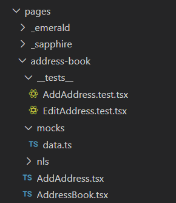

## Unit test

The file contains general information regarding unit test.

### Unit testing library

We are using:

1. [React Testing library](https://testing-library.com/docs/react-testing-library/intro) with
2. [Jest](https://jestjs.io/docs/en/getting-started)
3. And [MSW](https://mswjs.io/docs/) for mocking service response.

### Unit test setup

1. `src/setupTests.ts`. The file will be read by React script during UT. Global config/mock, before and after test block can be add to the file. See [Global setup file](https://create-react-app.dev/docs/running-tests/#srcsetuptestsjs-1) for more details. Feel free to add config/setup as needed.
2. `src/testing` folder
   - `src/testing/utils/test-utils.tsx` contains global [React testing library setup](https://testing-library.com/docs/react-testing-library/setup), check it out for more details. Feel free to add config/setup as needed.
   - `src/testing/i18n.ts` Mock translation, all texts will be translated to the translation key that UI passed in. e.g. calling `t('Checkout.continue')` will return string `'Checkout.continue'`. So that in the test we can easily verify the existence of text regardless of language that is being used.
   - `src/testing/mocks/handler.ts` and `src/testing/mocks/server.ts` are config/setup for [MSW REST API mock](https://mswjs.io/docs/getting-started/mocks/rest-api). The `handler` can be overridden in each individual test, if a service handler is not defined in the test, calling the service in the test will fallback to this global handler. Currently, the global handler is returning 404.
3. component folder structure.

   

   - test file in `__tests__` folder.
   - MSW test specific config/setup and other test specific data setup(e.g. redux state object for particular test) in `mocks` folder.

4. example (explanation in comments):

   ```ts
   //Standard libraries
   import React from "react";
   import userEvent from "@testing-library/user-event";
   //Test setup libraries
   import {
     render,
     screen,
     fireEvent,
   } from "../../../../testing/utils/test-utils";
   // UT component
   import AddAddress from "../AddAddress";
   //Foundation libraries
   import personContactService from "../../../../_foundation/apis/transaction/personContact.service";
   describe("AddAddress UT", () => {
   test("Check AddAddress component is rendered normally", () => {
   // Render Add Address component
   const { container } = render(<AddAddress />);

    // Check the breadcrums
    // AddressBook - hyperlink
    screen.getByText("AddressBook.Title");
    expect(screen.getByText("AddressBook.Title").closest("a")).toHaveAttribute(
      "href",
      "/address-book"
    );
    // StyledIcon check -  ">"
    const svgIcon = container.querySelector(".MuiSvgIcon-root");
    expect(svgIcon).toBeInTheDocument();
    // Add a new adress text check
    screen.getByText("AddressBook.AddrMsg");
    // Cancel button
    screen.getByRole("button", { name: "AddressBook.Cancel" });
    expect(screen.getByText("AddressBook.Cancel").closest("a")).toHaveAttribute(
      "href",
      "/address-book"
    );
    expect(screen.getByRole("button", { name: "AddressBook.Cancel" }))
      .toBeEnabled;
    // Create Address button - disabled state
    screen.getByRole("button", { name: "AddressBook.CreateAddress" });
    expect(
      screen.getByRole("button", { name: "AddressBook.CreateAddress" })
    ).toBeDisabled();
    });
   ```

### Further tips

When you render a component to test, you can query text rendered by the component, in order to set some baselines for the test or even assertions. This is separate than querying elements by class selector or test ids. This is done using the screen import from test utils react testing library.

This is how to import screen `import { render, waitForElement, screen } from "../../../../testing/utils/test-utils";`

So say you render Address Book component. You can then ensure it is rendered by querying the title "Address Book" which is always rendered in the component.

`expect(screen.queryByText("Address Book")).toBeDefined;`

You can also check for data assertions. If you know what data is being rendered by the component then you can search for some text on screen. For example, if you pass a list of addresses to the Address List component to be rendered, you know that it will create a list of address cards for each address in the list. These cards should have an address name. So you can test that the cards are rendered by checking for the names. If the names exist, the cards are rendered, the data is passed properly to address list, and thus it is working as intended

`expect(screen.queryByText("billing-joe")).toBeDefined;`

You can also check for negative assertions with "toBeUndefined"

Whenever we fire an event or any function call that triggers react hook state update and because we're not in the React call-stack we're ended up getting below warning.

`not wrapped in act(...)`

So lets wrap that in act(...)! Please see below link for more details and how to fix it.

[https://kentcdodds.com/blog/fix-the-not-wrapped-in-act-warning](https://kentcdodds.com/blog/fix-the-not-wrapped-in-act-warning)

Asserting the HTML elements are present or not present can be done by using below
`toBeInTheDocument()`
`not.toBeInTheDocument()`

For more information, please check below link
[https://testing-library.com/docs/guide-disappearance#asserting-elements-are-not-present](https://testing-library.com/docs/guide-disappearance#asserting-elements-are-not-present)

Below article link explains the most common mistakes and pitfalls usually developers might make and how we can avoid or improve it
[https://kentcdodds.com/blog/common-mistakes-with-react-testing-library](https://kentcdodds.com/blog/common-mistakes-with-react-testing-library)
